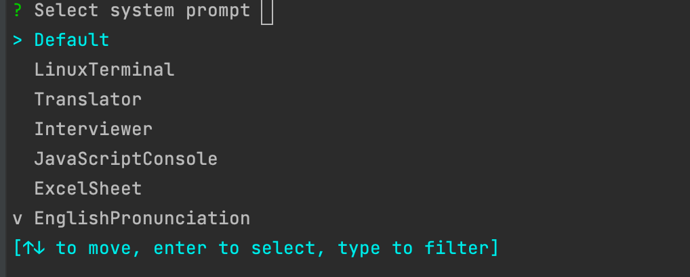

#  ChatGPT Client
## Install
```shell
cargo install --git https://github.com/misssonder/chatgpt-cli
```
## Usage
```shell
ChatGPT command line thar support multiple prompts

Usage: chatgpt [OPTIONS] --api-key <API_KEY>

Options:
  -a, --api-key <API_KEY>  Api key of the openai support
  -p, --prompt             Customize the prompt
  -h, --help               Print help
  -V, --version            Print version

```
### Prompts
#### support prompts

- Default 
- LinuxTerminal 
- Translator
- Interviewer
- JavaScriptConsole
- ExcelSheet
- EnglishPronunciation
- EnglishTeacher
- TravelGuide

you can click [awesome-chatgpt-prompts](https://github.com/f/awesome-chatgpt-prompts) to know more about chatGPT system prompt.